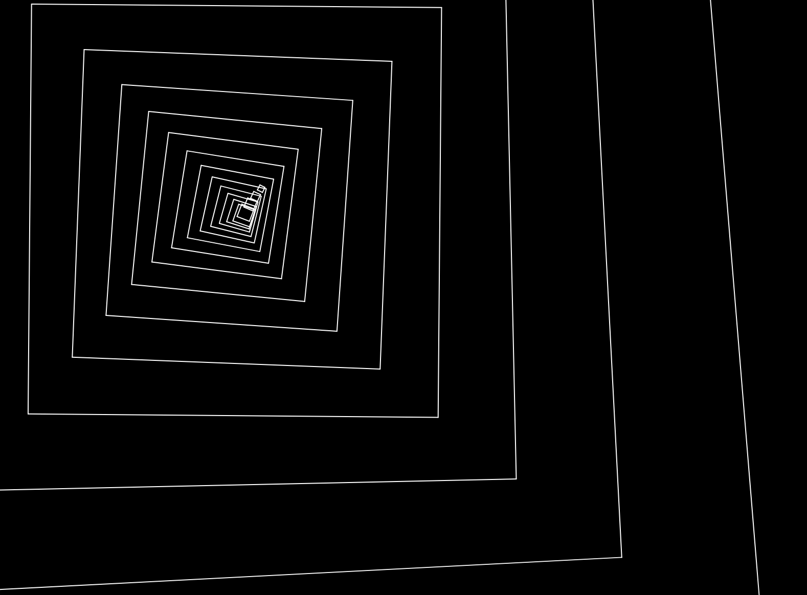

# Corridor

This is a p5.js tryout sketch, displaying a moving corridor made of frames
following random trajectories. Try it on [thibautvoirand.com/corridor](https://thibautvoirand.com/corridor/).

The goal is to link the corridor dynamically with audio input.

For now, the frames' brightness varies with the microphone input volume, and 
trajectory changes are triggered by volume peaks.

The microphone input with p5.js is limited to certain browsers. Access with
Chrome is limited to https.

 
